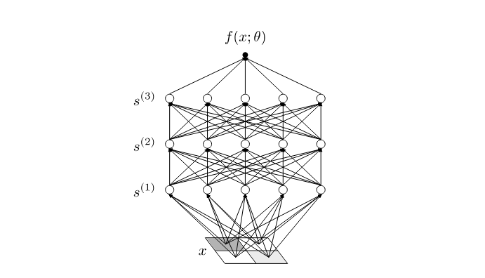

# 0.2 理论最小值
> 方法比发现更重要，因为正确的研究方法将导致新的、甚至更有价值的发现。
>
> —— Lev Landau

在本节中，我们将对我们的方法进行一个高层次的概述，为“为什么我们应该期望对深度神经网络的第一原理有所理解”提供一个最低限度的解释。然后我们将在接下来的章节中填写所有细节。

从本质上讲，`神经网络`是一种计算函数的方法，它由许多称为`神经元`的计算单元组成。每个神经元本身是一个非常简单的函数，它考虑输入信号的加权和，然后通过将该和的值与某个阈值进行比较，以特定的方式激发。然后，神经元被并行组织成多个`层`，而深度神经网络是由多个层依次组成的网络。该网络由神经元之间的激发阈值和加权连接进行参数化，为了给出潜在规模的感觉，当前最先进的神经网络可以具有超过1000亿个参数。图 1 显示了一个更合理大小的神经网络的结构图。

    
    
Figure1: 一个简单的多层神经网络图，描述了输入x如何通过一系列中间信号s(1)、s(2)和s(3)转换为输出f(x;θ)。白色圆圈表示神经元，顶部的黑点表示网络输出，参数θ是隐式的；他们对携带信号的不同箭头的重要性进行加权，并对每个神经元的启动阈值进行偏置

现在，让我们忽略所有这些结构，简单地将神经网络视为参数化函数

$$
\begin{aligned}
f(x;\theta),
\end{aligned}
\tag{0.1}
$$

其中 $x$ 是函数的输入，$\theta$ 是由大量用于控制函数形状的`参数`组成的向量。为了使这样的函数有用，我们需要以某种方式调整高维参数向量 $\theta$。在实践中，这分为两个步骤:

1. 首先，我们通过从计算上简单的概率分布中随机采样参数向量 $\theta$ 来初始化网络，
    
    $$
    \begin{aligned}
    p(\theta).
    \end{aligned}
    \tag{0.2}
    $$

    稍后，我们将讨论初始化分布 $p(\theta)$ 是一个好策略的理论原因，但更重要的是，这与实践中所做的工作相对应，本书中我们的方法是让理论分析与现实的深度学习场景相对应。

2. 其次，我们将参数向量调整为 $\theta \rightarrow \theta^*$ 使得得到的网络函数 $f(x;\theta^*)$ 尽可能接近期望的目标函数 $f(x)$:
    
    $$
    f(x;\theta^*) \approx f(x)
    \tag{0.3}
    $$

    这称为`函数近似`。为了找到这些调优 $\theta^*$，我们将网络函数 $f(x;\theta)$ 与`训练数据`，由多对从期望目标函数 $f(x)$ 的（但仅部分可观察到的）的 $(x,f(x))$ 组成。总体而言，对参数进行这些调整称为训练，用于调整参数的特定过程称为`学习算法`。

我们的目标是了解这种经过训练的网络函数：

$$
\begin{aligned}
f(x;\theta^*).
\end{aligned}
\tag{0.4}
$$

特别是，我们希望从这些训练参数 $\theta^*$ 的网络的第一原理微观描述中了解该函数的宏观行为。我们还想了解函数近似 (0.3) 是如何工作的，并评估 $f(x;\theta^*)$ 使用训练数据 $(x, f(x))$ 来逼近 $f(x)$ 的过程。考虑到参数 $\theta$ 的高维度和近似 (0.3) 所需的微调程度，这个目标可能看起来很天真，超出了任何现实理论方法的范围。 

更直接地看到我们将遇到的各种技术问题的一种方法是泰勒展开我们训练的网络函数 $f(x;\theta^*)$ 在参数 $\theta$ 的初始化值附近。作为示意，忽略了 $\theta$ 是向量，$f(x;\theta)$ 的导数是张量，我们看到

$$
\begin{aligned}
f(x;\theta^*) = f(x;\theta) + (\theta^* - \theta)\frac{df}{d\theta} + \frac{1}{2}{(\theta^* - \theta)}^2\frac{d^2f}{d\theta^2}+...,
\end{aligned}
\tag{0.5}
$$

其中，$f(x;\theta)$ 和它右侧的导数都在参数的初始化值处进行评估。泰勒展开说明了我们的三个主要问题:

## 问题 1
通常，级数（0.5）包含无限数量的项

$$
\begin{aligned}
f, \frac{df}{d\theta},\frac{d^2f}{d\theta^2},\frac{d^3f}{d\theta^3},,\frac{d^4f}{d\theta^4}, ...
\end{aligned}
\tag{0.6}
$$

为了使用函数（0.5）的泰勒表示，原则上我们需要计算它们。更具体地说，随着训练参数和初始化参数之间的差异，$(\theta^* − \theta)$ 的增大，获得训练网络函数 $f(x;\theta^*)$ 的良好近似所需的项的数量也变大。

## 问题 2
由于参数 $\theta$ 是从初始化分布 $p(\theta)$ 中随机采样的，所以每次初始化网络时，我们都会得到不同的函数 $f(x;\theta)。这意味着，来自（0.6）的每个项 $f, \frac{df}{d\theta},\frac{d^2f}{d\theta^2},$ 实际上是关于输入 $x$ 的随机函数。因此，初始化在网络函数及其导数上产生分布，我们需要确定映射，

$$
\begin{aligned}
p(\theta) \rightarrow p(\frac{df}{d\theta},\frac{d^2f}{d\theta^2},...),
\end{aligned}
\tag{0.7}
$$

这将我们从初始参数 $\theta$ 的分布带到网络函数 $f(x;\theta)$、其`梯度` $\frac{df}{d\theta}$和其 `Hessian` 矩阵 $\frac{d^2f}{d\theta^2}$ 等的联合分布。这是一个由无限多个随机函数组成的联合分布，这种函数通常具有复杂的统计相关性。即使我们暂时抛开函数的无限性，只考虑网络函数 $p(f)$ 的边际分布，仍然没有理由期望它是可解析的。

## 问题 3
参数学习得到的值 $\theta^*$，是复杂训练过程的结果。通常，$\theta^*$ 不是唯一的，可以依赖于所有：

$$
\begin{aligned}
\theta^* \equiv [\theta^*](\theta, f, \frac{df}{d\theta},\frac{d^2f}{d\theta^2},...; 学习算法; 训练数据)
\end{aligned}
\tag{0.8}
$$

在实践中，学习算法是迭代的，在许多步骤中累积变化，并且动力学是非线性的。因此，训练参数 $\theta$ 将以非常复杂的方式取决于初始化时的所有量——例如参数 $\theta$ 的特定随机样本、网络函数 $f(x;\theta)$ 及其所有导数 $\frac{df}{d\theta},\frac{d^2f}{d\theta^2},...;$ —— 以及学习算法的细节，还取决于构成训练数据的特定数据对 $(x，f(x))$。确定 $\theta^*$ 的解析表达式必须考虑到所有这些。

如果我们能够解决所有这三个问题，那么原则上我们可以使用泰勒级数表示（0.5）来研究训练的网络函数。更具体地说，我们会发现经过训练的网络函数的分布。

$$
\begin{aligned}
p(f^*) \equiv p(f(x;\theta)|学习算法;训练数据)
\end{aligned}
\tag{0.9}
$$

现在以一种简单的方式，以学习算法和我们用于训练的数据为条件。这里，简单来说，我们的意思是很容易评估不同算法或训练数据选择的分布，而无需每次解决问题 3 的版本。本书的主要目标是开发（0.9）的分析计算方法。

解决一般参数化函数 $f(x;\theta)$ 的三个问题是不容易的。好在，我们并非试图获得这些问题的一般解，而是只需关注深度神经网络函数。因此，上述问题的任何解决方案都必须利用神经网络函数的特定结构。虽然这本书的基本内容是这个解决方案奏效的细节，但在本节的其余部分，我们将尝试给出解决这些复杂问题的直觉。

## 稀疏性原理
要详细说明神经网络的结构，请向回查看图 1。请注意，对于图中所示的网络，每个中间或隐藏层由五个神经元组成，输入 $x$ 经过三个这样的隐藏层，然后在最后一层之后的顶部产生输出。通常，神经网络架构的两个基本方面是其宽度 $n$ 和深度 $L$

正如我们在 §0.1 中所预示的，在大量组件的限制中，通常会发现一些简化。然而，仅仅考虑任何大规模的宏观系统是不够的，采取正确的限制往往需要一些谨慎。将神经元视为网络的组成部分，本质上有两种主要的方式可以使网络规模增长：我们可以增加其宽度 $n$，保持其深度 $L$ 不变，或者我们可以增加深度 $L$，保持其宽度 $n$ 不变。在这种情况下，事实上将证明，前一个限制将使一切变得真正简单，而后一个限制在实践中将令人绝望地复杂和无用。

因此，让我们从正式接受极限开始

$$
\begin{aligned}
\lim_{n \rightarrow \infty}p(f^*), 
\end{aligned}
\tag{0.10} 
$$

并在此极限下研究理想化的神经网络。这被称为网络的`无限宽度限制`，作为一个严格的限制，它对于网络来说是相当不物理的：显然，你不能在有限的计算机上直接编程一个函数，使其具有无限数量的组件。然而，这个极限确实极大地简化了训练网络 $p(f^*)$ 上的分布，使我们的三个问题完全良性：

1. 解决问题 1，对于 $k \geq 2$ 的所有高阶导数项 $\frac{d^kf}{d\theta^k}$ 将有效地消失，这意味着我们只需要跟踪两个项，

    $$
    \begin{aligned}
    f, \frac{df}{d\theta}
    \end{aligned}
    \tag{0.11}
    $$
2. 解决问题 2，这些随机函数的分布将是独立的，

    $$
    \begin{aligned}
    \lim_{n\rightarrow \infty}p(f, \frac{df}{d\theta},\frac{d^2f}{d\theta^2},...) = p(f)p(\frac{df}{d\theta})
    \end{aligned}
    \tag{0.12}
    $$
3. 解决问题 3，训练动力学变得线性，并且完全依赖于学习算法的细节，让我们找到 $\theta^*$ 的闭合型式解析解
    $$
    \begin{aligned}
    \lim_{n \rightarrow \infty} \theta^* = [\theta^*](\theta,f,\frac{df}{d\theta};训练数据)
    \end{aligned}
    \tag{0.13}
    $$

因此，训练后的分布（0.10）是具有非零均值的简单`高斯分布`，我们可以很容易地分析此类网络正在计算的函数。

这些简化是稀疏性原则的结果。尽管我们似乎通过将网络扩展为具有无限数量的组件而使网络变得更加复杂，但从任何特定神经元的角度来看，无限数量的信号的输入使得大数均衡定律完全掩盖了信号中的许多细节。结果是，许多此类无限宽网络的有效理论导致了其描述中的极端`稀疏性`，例如实现了截断（0.11）。

不幸的是，形式上的无限宽度限制，$n \rightarrow \infty$, 这导致了深度神经网络的一个糟糕的模型：不仅无限宽是网络所具有的非物理性质，而且由此产生的训练分布（0.10）也导致了理论描述和实际观察之间的不匹配，对于不止一层的网络。特别是，根据经验可知，这种训练网络上的分布确实取决于用于训练它们的学习算法的属性。此外，我们将详细说明这种无限宽网络无法学习其输入的表示：对于任何输入 $x$，其在隐藏层 $s^{(1)}, s^{(2)},…$ 中的变换将从初始化开始保持不变，导致随机表示，从而严重限制了这种网络能够学习的函数类。由于非平凡`表示学习`是多层网络的一个经验证明的基本性质，这确实突出了在这个严格的无限宽度限制中理论和现实之间的对应关系的破裂。

从理论角度来看，这个极限的问题是，由于考虑到无限多的输入信号，每个神经元的精细细节都会被洗掉。特别是，这种无限累积完全消除了神经元之间的微妙关联，这些神经元在表征学习的训练过程中被放大。为了取得进展，我们需要找到一种恢复的方法，然后研究现实的有限宽度网络中存在的神经元之间的`相互作用`。

考虑到这一点，也许可以以这样的方式修正无限宽度限制，即当宽度 $n$ 较大时，修正变小。为此，我们可以使用微扰理论 —— 就像我们在物理学中分析交互系统一样 —— 并使用 `1/n 展开式`研究深度学习，处理层宽度的倒数 $ \epsilon \equiv 1/n$，作为我们的小扩展参数：$\epsilon \ll 1/n$。换句话说，我们将放弃严格的无限宽度限制，并使用以下扩展计算训练分布（0.9）：

$$
\begin{aligned}
p(f^*) \equiv p^{\{0\}}(f^*) + \frac{p^{\{1\}}(f^*)}{n} + \frac{p^{\{2\}}(f^*)}{n^2} + ...
\end{aligned}
\tag{0.14}
$$

其中 $p^{\{0\}}(f^*) \equiv \lim_{n \rightarrow \infty} p(f^*)$ 是前面讨论过的无限宽度限制，(0.10)，当 $k \geq 1$ 时的 $p^{\{k\}}(f^*)$ 提供了对这个限制的级数修正。

在本书中，我们将特别计算第一个这样的修正，将展开截断为：

$$
\begin{aligned}
p(f^*) \equiv p^{\{0\}}(f^*) + \frac{p^{\{0\}}(f^*)}{n} + O(\frac{1}{n^2})
\end{aligned}
\tag{0.15}
$$

这种相互作用的理论仍然很简单，却足以使我们的三个问题变得容易处理：

1. 解决问题 1，现在 $k$ 的所有高阶导数项 $\frac{dkf}{d\theta}$ 当 $k \geq 4$ 将有效地给出 $\frac{1}{n^2}$ 级或更小的影响，这意味着要获取 $\frac{1}{n}$ 级的主导影响，我们只需要跟踪四个项：

    $$
    \begin{aligned}
    f, \frac{df}{d\theta},\frac{d^2f}{d\theta^2},\frac{d^3f}{d\theta^3}
    \end{aligned}
    \tag{0.16}
    $$

    因此，我们看到稀疏性原则仍然会限制双重有效理论描述，尽管不像无限宽度限制那样广泛。

2. 解决问题2，这些随机函数在初始化时的分布，
    
    $$
    \begin{aligned}
    p(f, \frac{df}{d\theta},\frac{d^2f}{d\theta^2},\frac{d^3f}{d\theta^3})
    \end{aligned}
    \tag{0.17}
    $$

    在 $\frac{1}{n}$ 阶时几乎是简单的，我们将能够使用微扰理论来详细计算。

3. 解决问题3，我们将能够使用动态扰动理论来把我非线性的训练动力学，并找到 $\theta^*$ 的封闭形式解析解：
    
    $$
    \begin{aligned}
    \theta^* \equiv [\theta^*](\theta, f, \frac{df}{d\theta},\frac{d^2f}{d\theta^2},...; 学习算法; 训练数据)
    \end{aligned}
    \tag{0.18}
    $$

    特别是，这将使解决方案对学习算法细节的依赖变得透明和显著。

因此，我们对 $\frac{1}{n}$ 阶（0.15）的训练分布的描述将是`近似高斯分布`。

除了可分析处理之外，这种 $\frac{1}{n}$ 阶的截断描述将满足我们计算和理解训练网络函数 $p(f^*)$ 上的分布的目标。由于结合了神经元之间的相互作用，这种描述依赖于学习算法的细节，正如我们将看到的，包括非平凡的表示学习。因此，从质量上讲，这个 $\frac{1}{n}$ 阶的有效理论比无限宽描述更接近于现实的神经网络，使其作为理解深度学习的理论`最小模型`更有用。

如何定量对应关系呢？由于我们可以通过计算展开式（0.14）中的高阶项获得一系列更精细的描述，那这些项是否也需要包含在内？

虽然我们在书中介绍的形式使计算 $\frac{1}{n}$ 展开中的这些附加项完全系统化 —— 尽管可能有些乏味 —— 但研究领先修正的一个重要副产品实际上是对这种截断误差的更深入理解。特别是，我们将发现，与宽度 $n$ 成比例的是深度 $L$。也就是说，我们将看到，扩展项（0.14）的相对大小由深度与宽度纵横比给出：

$$
\begin{aligned}
r \equiv L/n
\end{aligned}
\tag{0.19}
$$

这让我们可以通过以下方式重新定义对无限宽与有限宽以及浅与深的理解：

1. 在严格限制 $r \rightarrow 0$ 中，神经元之间的相互作用关闭：无限宽度限制（0.10）实际上是一个不错的描述。然而，这些网络不能称为深度网络，因为它们的相对深度为零：$L/n = 0$

2. 在 $0<r \ll 1$ 的情况下，神经元之间存在非平凡的相互作用：以 $\frac{1}{n}$阶截断的 (0.15) 有限宽度有效理论给出了训练网络输出的精确计数。这些网络是有效深的。

3. 在区域 $r \gg 1$ 中，神经元是强耦合的：网络将表现得混沌，由于从实例化到实例化的大波动，没有有效的描述。这些网络太深了。

因此，大多数实际使用的网络实际上具有相当小的深度与宽度比，因此我们在 $\frac{1}{n}$ 阶的截断 (0.15) 描述也将提供很大的定量对应关系。

由此，我们可以看出，要真正描述多层神经网络的特性，即要理解深度学习，我们需要研究大型但有限宽度的网络。通过这种方式，我们将能够找到现实的深度神经网络的宏观有效的理论描述。

