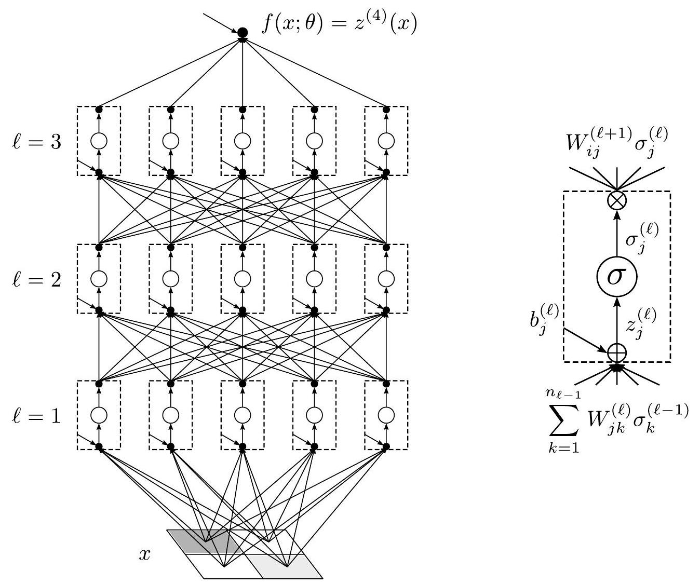

# 2.1 函数逼近
随着认知科学和神经科学启发了人工智能，人工神经网络这一学科有着丰富的历史。${ }^{1}$ 这里，我们的出发点将是函数 $f(x)$ 的讨论。

---

${ }^{1}$ 人工神经元是由McCulloch和Pitts于1943年发明的，作为生物神经元的模型。他们的神经元本质上是一个带有偏差的感知器，但没有可学习的权重。具有可学习权重的感知器模型由Rosenblatt于1958年发明[8]。在意识到图形处理单元（GPU）非常适合于训练和运行神经网络所需的并行计算之后，深度学习在2012年才真正形成。

---

有些函数非常简单，很容易用基本运算来描述：加法、减法、乘法和除法。例如，考虑恒等函数 $f(x)=x$ 或指数函数 $f(x)=e^{x}$。前者是琐碎的定义，不涉及任何操作。后者是一个特殊的函数，可以用多种方式定义，例如通过其泰勒级数

$$
\begin{aligned}
e^{x} \equiv \sum_{k=0}^{\infty} \frac{x^{k}}{k !} .    
\end{aligned}
\tag{2.1}
$$

此定义根据加法、乘法和除法的基本运算构造指数函数：分子 $x^{k}$ 表示变量 $x$ 的重复乘法 $k$ 次，以及阶乘 $k！$ 分母表示整数的重复乘法 $k !=1 \times 2 \times \cdots \times(k-1) \times k$.。尽管对指数函数的描述涉及无穷多个项的和，但根据这些简单操作计算该函数的实际指令（2.1）非常紧凑，它们只占一行的七分之一，而且对于许多目的，只需要和中的前几个项就可以得到 $e^{x}$ 的有用近似值。

有些函数非常复杂，它们的基本操作描述不太可能符合任何印刷书籍的范围。例如，假设函数 $f(x)$ 将图像 $x_{i}$（表示为与黑白像素化图像相对应的数字矢量）作为输入，如果图像 $x_{i}$ 描绘了猫，则输出 1，否则输出 0。虽然这样的分类功能应该存在，因为人类可以识别猫的图像，但如何用加法和乘法这样的简单操作来描述这样的功能却一点也不清楚。人工智能（AI）的主题主要关注这类功能：人类易于计算，但难以用基本运算来描述。

表示如此难以描述的函数所需的概念飞跃是从一组灵活的函数 $\{f(x ; \theta)\}$ 开始，该函数由由可调模型参数向量 $\theta_{\mu}$ 参数化的简单组件构成。然后尝试明智地调整这些模型参数 $\theta_{\mu}$ ，以便近似原始的复杂函数，使得 $f\left(x ; \theta^{\star}\right) \approx f(x)$.。然后，函数集 $\{f(x ; \theta)\}$ 的描述以及模型参数 $\theta_{\mu}^{\star}$ 的设置用作所需函数 $f(x)$ 的有用近似描述。这被称为函数近似，而调整模型参数 $\theta_{\mu}$  的过程被称为学习算法。

更具体地说，让我们将函数 $f(x)$ 的输入集合表示为 $n_{0}$ 维向量的集合 $\mathcal{D}$ 

$$
\begin{aligned}
\mathcal{D}=\left\{x_{i ; \alpha}\right\}_{\alpha=1, \ldots, N_{\mathcal{D}}},    
\end{aligned}
\tag{2.2}
$$

称为输入数据。这里，样本索引 $\alpha$ 标记 $N_{\mathcal{D}}$ 元素数据集中的每个样本，矢量索引 $i=1, \ldots, n_{0}$ 标记输入矢量的分量。

在我们上面的激励示例中，每个数字 $x_{i ; \alpha}$ 指的是 $N_{\mathcal{D}}$ 图像的数据集 $\mathcal{D}$ 中的第 $\alpha$ 图像的第 $i$ 个像素，每个图像可能描绘猫，也可能不描绘猫。通过调整模型参数 $\theta_{\mu}$ ，使函数 $f\left(x ; \theta^{\star}\right)$ 输出尽可能多的输入数据的正确答案，我们可以尝试以不再难以描述的方式近似难以理解的cator not函数。使用数据集 $\mathcal{D}$ 而不是编程来训练这些函数的总体想法叫做机器学习，与数字计算机的传统冯·诺伊曼模型形成鲜明对比。

虽然任何一组参数化函数都可以用于函数逼近，但 ${}^{2}$ 我们的重点将放在最初从简化的大脑模型导出的一组特定的可组合函数上。这种函数最初被称为人工神经网络，现在被称为神经网络。深度学习是机器学习的一个分支，它使用神经网络作为函数逼近器，特别强调堆叠许多结构相似的组件。让我们更详细地了解一下它是如何工作的。

神经网络最基本的组成部分是神经元。受生物神经元行为的启发，人工神经元基本上由两个简单的操作组成：

1. 神经元的预激活 $z_{i}$ 是传入信号 $s_{j}$ 的线性聚合，其中每个信号由 $W_{i j}$ 加权，并由  $b_{i}$ 偏置

    $$
    \begin{aligned}
    z_{i}(s)=b_{i}+\sum_{j=1}^{n_{\text {in }}} W_{i j} s_{j} \quad \text { for } \quad i=1, \ldots, n_{\text {out }} .    
    \end{aligned}
    \tag{2.3}
    $$

2. 然后，每个神经元根据加权和有偏差的证据（即根据预激活 $z_{i}$ 的值）激发或不激发，并产生激活

    $$
    \begin{aligned}
    \sigma_{i} \equiv \sigma\left(z_{i}\right) .    
    \end{aligned}
    \tag{2.4}
    $$

    标量值函数 $\sigma(z)$ 称为激活函数，独立作用于预激活向量的每个分量。

总之，这些 $n_{\text {out }}$ 神经元形成一个层，该层接收信号 $s_{j}$ 的 $n_{\text {in }}$ 维向量，并输出激活 $\sigma_{i}$ 的  $n_{\text {out }}$ 维度向量。在这种集体视角下，一个层由一个偏差向量 $b_{i}$ 和一个权重矩阵 $W_{i j} $参数化，其中 $i=1, \ldots, n_{\text {out }}$ 和 $j=1, \ldots, n_{\text {in }}$ 以及一个固定的激活函数 $\sigma(z)$。

有了这些组件，我们可以通过将许多神经元组织成一个层，然后迭代地堆叠许多这样的层，从而使一个层中神经元的输出激活成为另一个层的神经元的输入信号，从而形成一组越来越灵活的功能。神经元的组织及其连接模式被称为神经网络结构。基于这种堆叠多层神经元的原理的原型神经网络架构被称为多层感知器（MLP）${ }^{3}$

---

${ }^{2}$ 例如，考虑高斯函数的和，其中每个高斯函数的平均值和方差扮演可调整参数的角色。

---

激活函数通常被选择为非线性函数，以增加神经网络函数 $f(x ; \theta)$ 的表现力。最简单且历史上第一次激活的函数要么启动，要么不启动： $\sigma(z)=1$ （对于 $z \geq 0$ ）， $\sigma(z)=0$ （对于 $z<0$ ）。换句话说，当且仅当加权累积证据 $\sum_{j} W_{i j} x_{j}$ 超过激发阈值 $-b_{i}$ 时，每个神经元激发。更一般地，激活函数不是二进制的，可以将证据的强度纳入其输出。在$\$2.2$中，我们将描述深度学习中常用的许多激活函数。

MLP通过以下迭代方程递归定义

$$
\begin{aligned}
& z_{i}^{(1)}\left(x_{\alpha}\right) \equiv b_{i}^{(1)}+\sum_{j=1}^{n_{0}} W_{i j}^{(1)} x_{j ; \alpha}, \quad \text { for } \quad i=1, \ldots, n_{1}, \\
& z_{i}^{(\ell+1)}\left(x_{\alpha}\right) \equiv b_{i}^{(\ell+1)}+\sum_{j=1}^{n_{\ell}} W_{i j}^{(\ell+1)} \sigma\left(z_{j}^{(\ell)}\left(x_{\alpha}\right)\right), \quad \text { for } \quad i=1, \ldots, n_{\ell+1} ; \ell=1, \ldots, L-1,    
\end{aligned}
\tag{2.5}
$$

它描述了一个具有$L$层神经元的网络，每个层 $\ell$ 由 $n_{\ell}$ 个神经元组成 ${ }^{4}$ 我们在图2.1中描述了一个示例 MLP 架构。层的数量 $L$ 定义了网络的深度，每个层中不同数量的神经元 $n_{\ell=1, \ldots, L-1}$ 定义了层的宽度。深度和隐藏层宽度是定义网络形状的可变架构超参数，而 $n_{0}$ 和 $n_{L}$ 的值分别由函数近似任务的输入和输出维度设置。特别是，网络计算的最终层预激活

$$
\begin{aligned}
f(x ; \theta)=z^{(L)}(x),    
\end{aligned}
\tag{2.6}
$$

作为函数逼近器，其模型参数 $\theta_{\mu}$ 是来自所有层的偏差和权重的联合。有时，将此模型参数集合视为一个显式向量 $\theta_{\mu}$ 会很方便，该向量的组件覆盖所有模型参数。在这种情况下， $\theta_{\mu}$ 的维数以及模型参数的总数由下式给出

$$
\begin{aligned}
P=\sum_{\ell=1}^{L}\left(n_{\ell}+n_{\ell} n_{\ell-1}\right),    
\end{aligned}
\tag{2.7}
$$

其与网络的宽度成二次方比例并且与深度成线性比例。

---

${ }^{3}$ 这里，“感知器”这个名字是从罗森布拉特的感知器体系结构中继承而来的[8]，它最初是为了模拟人类的感知而设想的。感知器名称也用于指代原始的步进函数激活函数，参见 $\$ 2.2$ 的第一个条目

${ }^{4} \mathrm{~A}$ MLP的更现代的名称是完全连接网络（FCN），这突出了一个事实，即给定层 $\ell$ 中的每个神经元都与层 $\ell+1$ 中的每一个神经元有连接，如图 $2.1$ 所示。就架构所需的参数数量而言，这种密集的连接模式在计算上是昂贵的，并且应该与本节末尾描述的更稀疏的架构进行对比。为了强调网络的深度而不是连接的密度，我们将在本书中主要使用多层感知器这一名称，而不是完全连接网络这一名称。

---

    
    

    Figure 2.2: 常用的激活函数$\sigma（z）$。预激活$z$和激活$\sigma$的网格单位均为一。（泄漏的ReLU未显示。）
    

---

中间层 $\ell=1, \ldots, L-1$ 被称为隐藏层，因为来自这些层的神经元的预激活和激活不是网络输出的一部分。一方面， $\ell<L$ 的变量 $z^{(\ell)}(x)$ 只是为了构造一组越来越灵活的函数而引入的临时变量，其表达能力足以接近难以描述的函数。另一方面，与物理大脑类似，这些变量被认为编码了关于神经网络如何逼近的有用信息；例如，如果一个特定的神经元识别出一条尾巴、一根胡须或一种代表毛发的图案，那么它可能会发光，这些特征都可能对确定一张图像中是否包含猫很有用。

除了MLP之外，神经网络架构的选择通常是由我们试图逼近的函数的性质驱动的。例如，数据集 $\mathcal{D}$ 的属性在已知和明确的情况下，可用于在架构中构建归纳偏差，以便生成的函数集可以更好地表示底层函数 ${ }^{5}$ 让我们看几个例子。

1. 对于计算机视觉（CV）应用，卷积神经网络（CNN）或卷积网络[9-13]用于利用图像中的信息以空间局部方式组织的事实，通常考虑平移不变性 ${ }^{6}$

2. 对于自然语言处理（NLP）应用，转换器架构（目前还没有首字母缩略词）用于处理顺序输入，例如一段文本或编码蛋白质的氨基酸序列，从而鼓励序列中任何元素之间的相关性[14]。模型的这一特性被恰当地称为注意力。

这些诱导性偏差的一个重要特性是它们诱导了权重之间的约束或关系。例如，我们可以将卷积层视为特定类型的MLP层，其中许多权重设置为零，剩余权重的值在几个不同的神经元之间进一步共享。这种特性被称为重量捆绑。这意味着卷积层实际上属于使用MLP层可描述的函数类，但除非明确实施约束，否则很难通过训练找到卷积层。只要空间局部性和平移不变性的归纳偏差得到很好的证明，卷积层通过大量减少要训练和存储的权重数量，具有明显的计算优势。

---

${ }^{5}$ 我们将在 $\$ 6, \$ 11$ 和尾声 $\varepsilon$ 中从不同的角度讨论MLP的归纳偏见

${ }^{6}$  对于二维卷积层，MLP 的迭代方程 $2.5$ 替换为

$$
\begin{aligned}
z_{i,(c, d)}^{(\ell+1)}\left(x_{\alpha}\right) \equiv b_{i}^{(\ell+1)}+\sum_{j=1}^{n_{\ell}} \sum_{c^{\prime}=-k}^{k} \sum_{d^{\prime}=-k}^{k} W_{i j}^{(\ell+1)} \sigma\left(z_{j,\left(c+c^{\prime}, d+d^{\prime}\right)}^{(\ell)}\left(x_{\alpha}\right)\right),    
\end{aligned}
\tag{2.8}
$$

其中，在 $z_{i,(c, d)}^{(\ell)}$ 中，第一索引 $i$ 是辅助信道索引，配对索引 $(c, d)$ 是二维空间索引，数字$k$是每个层的固定常数，确定卷积窗口的大小。特别地，在输入的不同空间位置上使用相同的权重，这促进了图像数据通常是平移不变的归纳偏差。换句话说，无论猫在图像中的位置如何，它仍然是一只猫。在撰写本文时，卷积层是许多现代深度学习架构的重要组成部分，但这种情况在未来可能会改变。请注意。

---

不管深度学习中使用的现代神经网络架构中根深蒂固的这些特定的归纳偏见，所有人的共同点是通过将神经组件组织成许多迭代层来构建一组灵活的函数。MLP是这些神经网络架构中最简单的一种，依赖于这种堆叠思想，因此为有效的深度学习理论提供了一个最小的模型。具体而言，我们期望（a）我们发现的深度学习理论的原理在基于堆叠多层神经组件的思想的各种架构中是通用和有效的，以及$（b）$所产生的有效理论形式可以根据需要专门用于感兴趣的特定架构，用这本书来指导如何得出这样的理论。特别是，我们可以通过在适当的位置交换MLP迭代方程（2.5）（例如卷积层迭代方程（2.8））来研究我们形式中的其他架构。当我们在  $\$ 4$ 中开始计算有效理论时，我们将提供在何处进行此类替换的指针

最后，在附录B中，我们将研究具有残差连接的神经网络，称为残差网络。这些体系结构经过特别修改，以实现对越来越深的网络的训练。在该附录的最后一节中，我们还将解释如何将我们的有效理论方法扩展到一般残差网络，包括残差卷积网络或ResNet和变压器架构。
