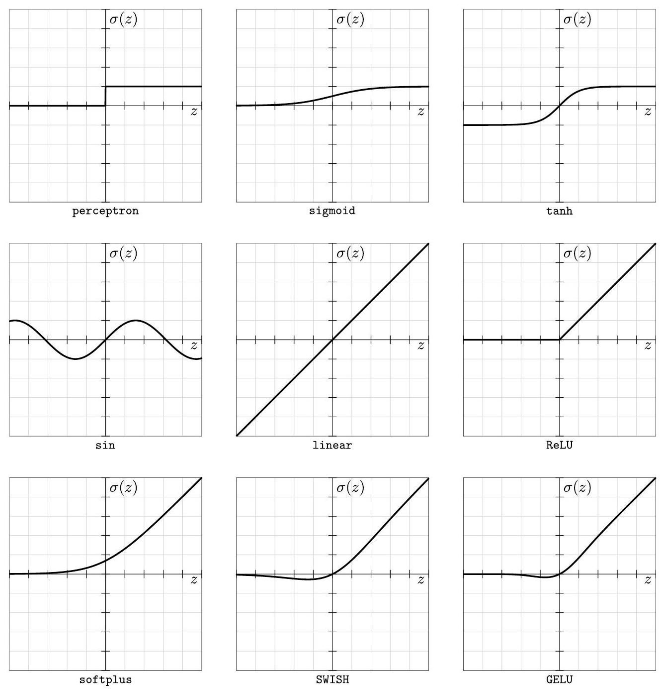

# 2.2 激活函数

在本节中，我们将讨论一些最常见的激活函数。并不会事无巨细，因此不必担心本节令人筋疲力尽。为了便于理解，我们在图 2.2 中将所有这些激活函数绘制在一起。在第五章中，我们将使用我们的有效理论来评估这些激活函数在允许输入信号有效地通过深度网络方面的相对有用性。

## 感知机
感知机是最初的激活函数[7]。它只是一个阶跃函数

$$
\begin{aligned}
\sigma(z)= 
\begin{cases}
1, & z \geq 0, \\ 
0, & z<0,
\end{cases}    
\end{aligned}
\tag{2.9}
$$

对应于计算机科学家的简单概念：神经元要么激发并输出 1，要么不激发并输出 0。

尽管逻辑简单，但这是一个糟糕的选择。正如我们将看到的，为了有效地通过网络（ $\$5$ 和 $\$9$ ）传递信号并训练它们（$\$10$），

---

${ }^{7}$ 或者，可以对感知机进行移位和缩放，使得 $\sigma(z)=\operatorname{sign}(z)$。

---

    
    

    Figure 2.2: 常用的激活函数$\sigma（z）$。预激活$z$和激活$\sigma$的网格单位均为一。（泄漏的ReLU未显示。）
    

传播有关预激活 $z$ 的多个信息是有帮助的。感知机具有历史意义，但从未用于深度神经网络。

## Sigmoid

Sigmoid 激活函数是一个逻辑函数

$$
\begin{aligned}
\sigma(z)=\frac{1}{1+e^{-z}}=\frac{1}{2}+\frac{1}{2} \tanh \left(\frac{z}{2}\right)    
\end{aligned}
\tag{2.10}
$$

这是感知机的平滑版本。它不仅是连续的，而且还保存了关于预激活的大小的信息，尽管在 $z＝0$ 附近，函数几乎是线性的。但在这个范围之外，sigmoid会严重压缩这样的信息，因为它变得越来越像感知机，当 $z \rightarrow \infty$ 时，它会饱和为 $\sigma(z)=1$ ，当 $z \rightarrow-\infty$ 时，饱和为 $\sigma(z)=0$ 。

作为从 $(-\infty, \infty)$ 域到 $[0,1]$ 范围的映射，sigmoid 还具有将对数赔率转换为概率的自然解释，这是它在机器学习中的主要应用。对于深度学习，sigmoid 的可微性对于开发用于训练具有隐藏层的神经网络的学习算法（反向传播）至关重要[15]。尽管如此，sigmoid 激活函数在深度神经网络中仍然是一个糟糕的选择：正如我们将在第五章中看到的，一个问题是它没有通过原点。

## $\operatorname{Tanh}$
双曲正切或正切激活函数

$$
\begin{aligned}
\sigma(z)=\tanh (z)=\frac{e^{z}-e^{-z}}{e^{z}+e^{-z}}=\frac{e^{2 z}-1}{e^{2 z}+1},    
\end{aligned}
\tag{2.11}
$$

如（2.10）所示，是缩放的（在激活之前和之后）和移位的S形。特别重要的是，它被转换为 $\sigma(0)=0$ [16]。

tanh 可能是除了稍后将讨论的 ReLU 或 ReLU 类激活函数之外最流行的激活函数选择，并且可以说 tanh 是最流行的平滑激活函数。作为一个示例性的平滑激活函数，tanh 将在本书中引起我们的极大兴趣。

## Sin

sin 激活函数就像它听起来的那样：

$$
\begin{aligned}
\sigma(z)=\sin (z),    
\end{aligned}
\tag{2.12}
$$

i、 e.三个标准三角函数之一。周期性非线性已经流行了很长一段时间，例如参见[17]，尽管它们从未真正流行过。

## 比例不变： linear, ReLU, and leaky ReLU

尺度不变激活函数是满足以下条件的任何激活函数

$$
\begin{aligned}
\sigma(\lambda z)=\lambda \sigma(z),    
\end{aligned}
\tag{2.13}
$$

对于任何正的重新缩放 $\lambda$。我们称这些激活函数为比例不变，因为预激活 $z \rightarrow \lambda z$ 的任何缩放都可以通过激活 $\sigma(z) \rightarrow \lambda^{-1} \sigma(z)$ 的逆缩放来撤销。表单的 ${ }^{8}$ —— 激活函数满足此条件

$$
\begin{aligned}
\sigma(z)= \begin{cases}a_{+} z, & z \geq 0 \\ a_{-} z, & z<0 .\end{cases}    
\end{aligned}
\tag{2.14}
$$

标度不变激活函数的类别包括线性  $\left(a_{+}=a_{-}=a\right)$、校正线性单元或ReLU $\left(a_{+}=1, a_{-}=0\right)$ [18，19]和泄漏 ReLU $\left(a_{+}=1\right.$, $\left.a_{-}=a\right)$ [20]激活函数。ReLU是深度神经网络中使用的最流行的激活函数，因此在本书中我们将非常感兴趣。

为了加深我们对尺度不变性的理解，让我们考虑其他激活函数如何打破它。例如，考虑 tanh 激活函数 $\sigma(z)=\tanh (z)$。数学上，tanh违反了尺度不变性，因为  $\tanh (\lambda z) \neq$ $\lambda \tanh \sigma(z)$，除非 $\lambda=1$。特别是，虽然激活函数对于小的预激活近似线性，即 $|z| \ll 1$的 $\tanh (z) \approx z$ ，但对于大的预激活，即 $|\tanh (z)| \approx 1$ for $|z| \gg 1$，它饱和。因此，tanh有一个内在的交叉尺度 $|z| \sim 1$ ，它将两个政权分开。我们可以在图$2.2$中直观地看到这一点。如果我们缩小，所有非尺度不变激活函数（例如感知机、sigmoid和tanh）看起来都会被压扁，而尺度不变激活函数（例如ReLU和linear）在任何尺度上看起来都一样。

最后，请注意，由于原点$z=0$处的扭结，所有比例不变的激活函数（除了适命名的线性激活）都会在网络输入和输出之间创建非线性关系。将具有这些非线性激活函数的多层神经元叠加在一起会累积非线性，从而使这种深层神经网络能够表达高度非线性的函数。

## 类似 ReLU 的: softplus, SWISH, and GELU

尽管ReLU很受欢迎，但它并不平滑，这一事实令人不安。为了纠正这种情况，已经提出了多种类似ReLU的平滑激活，并实现了半流行，我们将考虑以下三种激活：

---

${ }^{8}$ 为了证明这一必要性陈述，首先取尺度不变性方程 2.13 相对于 $z$ 的导数，对于任何 $\lambda>0$，它给出 $\sigma^{\prime}(\lambda z)=\sigma^{\prime}(z)$。然后注意，对于 $z>0$，这强制执行一个常量导数 $a_{+}$，而对于 $z<0$，强制执行另一个常量派生 $a_{-}$。最后，为了满足 $2.13$，我们还必须具有 $\lim _{z \rightarrow \pm 0} \sigma(z)=0$。量子电动力学。

---

1. softplus 激活函数[21]
    $$
    \begin{aligned}
    \sigma(z)=\log \left(1+e^{z}\right),    
    \end{aligned}
    \tag{2.15}
    $$
    对于大参数 $z \gg 1$，$\sigma(z) \approx z$ 表现为线性，对于负参数，$\sigma(z) \approx e^{-|z|}$ 表现为指数消失。重要的是，softplus 不通过原点：$\sigma(0)=\log (2)$。
2. SWISH 激活函数[22]定义为
    $$
    \begin{aligned}
    \sigma(z)=\frac{z}{1+e^{-z}},    
    \end{aligned}
    \tag{2.16}
    $$
    其是逻辑函数 $2.10$ 乘以预激活 $z$。逻辑函数表现为一个连续的开/关开关，因此SWISH近似于 ReLU，我们记得它被定义为一个离散的开/闭开关乘以预激活 $z$。特别是，对于$z<0$ ，SWISH表现为 $\sigma(z) \approx z$ ，但对于 $z<0$，其表现为 $\sigma(z) \approx 0$。此外，乘以$z$可确保SWISH通过原点， $\sigma(0)=0$。
3. 高斯误差线性单元（GELU）激活函数[23]与SWISH非常相似。它由以下表达式给出
    $$
    \begin{aligned}
    \sigma(z)=\left[\frac{1}{2}+\frac{1}{2} \operatorname{erf}\left(\frac{z}{\sqrt{2}}\right)\right] \times z    
    \end{aligned}
    \tag{2.17}
    $$
    其中误差函数 $\operatorname{erf}(z)$ 由
    $$
    \begin{aligned}
    \operatorname{erf}(z) \equiv \frac{2}{\sqrt{\pi}} \int_{0}^{z} d t e^{-t^{2}},
    \end{aligned}
    \tag{2.18}
    $$
    这是高斯函数的部分积分。特别是，$\operatorname{erf}(z)$ 的图形看起来与 $\tanh (z)$ 的图形非常相似，因此GELU定义中使用的缩放和移位版本的图形 $\frac{1}{2}+\frac{1}{2} \operatorname{erf}\left(\frac{z}{\sqrt{2}}\right)$ 看起来与逻辑函数2.10的图形非常类似）。与 SWISH 一样，它穿过原点，并且在任何方向上离 0 越远，它的行为就越像 ReLU。

在对 ReLU 进行平滑处理时，这三个激活函数都引入了内禀尺度，并违反了尺度不变性条件（2.13）。

